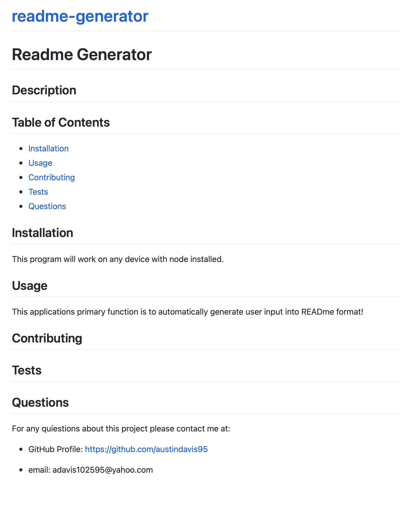

# Readme Generator 

## Description

    In this project I created a READme generator using only Java Script. This application uses json and node to create all the applications content in javascript. Using the terminal to enter all desired content to application.
    

  
## Table of Contents
  
* [Installation](#installation)
* [Usage](#usage)
* [Contributing](#contributing)
* [Tests](#tests)
* [Questions](#questions)
  
## Installation
  
This program will work on any device with node installed.
  
## Usage
  
This applications primary function is to automatically generate user input into READme format!
  
  
## Contributing
  Starter code from Canvas, Moduale 9 content, w3schools.

  
## Tests
  

  
## Questions
  
For any quiestions about this project please contact me at:
  
* GitHub Profile: [https://github.com/austindavis95]
  
* email: adavis102595@yahoo.com

## URLs
https://austindavis95.github.io/readme-generator/

Live URL to screen recording:
https://austindavis95.github.io/readme-generator/readme-generator.mp4

## Images

